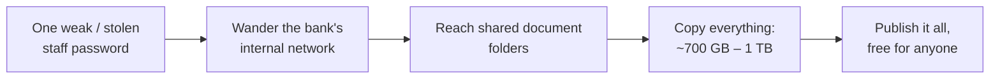
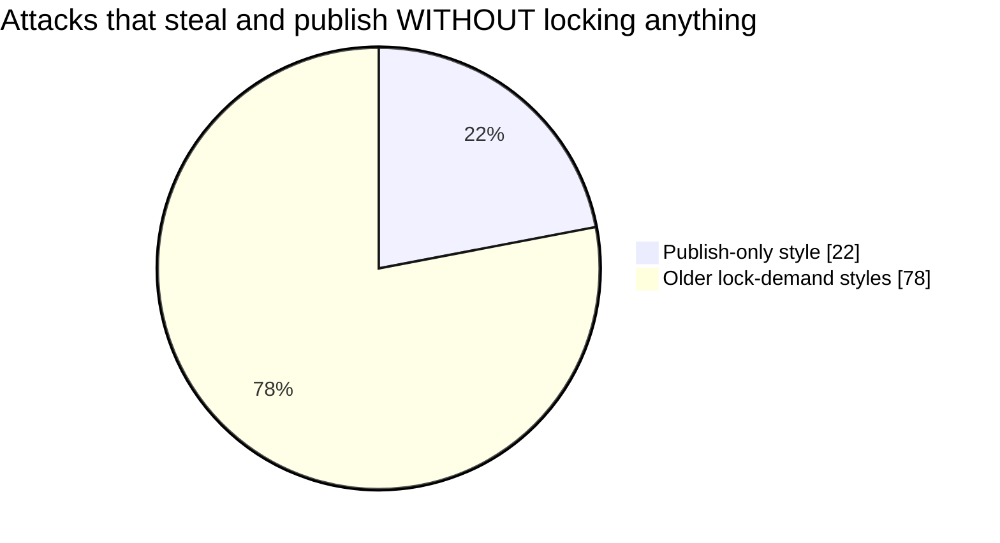

# When a Bank's Filing Cabinets Go Public
### The Bank of Baroda leak — explained for the rest of us

*Plain-language edition · August 2026 · CashlessConsumer research desk*
*Companion to the full technical report. This guide opens no stolen files and repeats none of their contents — it only explains what is publicly known and what it means for you.*

> **References to claims:** every figure and statement below is traceable. Each claim maps to a named public source, coded by evidence class — **A** = the criminals' own announcement · **B** = independently observed infrastructure behaviour · **C** = official/regulatory record · **D** = independent security-community reporting. The full mapping lives in the appendix, *How We Know Every Claim*. This is the plain-language companion to the technical report at `Documents/research/bob-breach-technical-report.md`.

---

## The Story in One Minute

On **24 July 2026**, a criminal gang calling itself **Triple X** announced that it had emptied the filing cabinets of Bank of Baroda — India's second-largest government-run bank — and carried away roughly **700 GB to 1 TB of internal paperwork**. For scale: that is like 150+ HD movies' worth of space, except filled entirely with documents, spreadsheets and scanned forms.

Within a day or two, the gang put the haul on a hidden corner of the internet **where anyone could walk in and browse it freely — no password, no payment, nothing**. Imagine a public library where every book happens to be your bank's private paperwork.

Then came the strangest part: **silence**. A month later, the bank had said nothing of substance. The banking regulator had published nothing. The cyber agency had confirmed nothing. No customer has been officially told whether their papers are in the pile.

The silence is not a footnote to this story. In India, it *is* the story.

---

## Two Kinds of Bank Robbery

To understand why experts are unsettled, picture what a bank keeps:

| | What it is | Our analogy |
|---|---|---|
| **The vault** | Your actual money records — balances, payments | The cash counter |
| **The filing cabinets** | Everything else: your Aadhaar/PAN copies, loan papers, audit reports, the bank's own security manuals, staff directories | The back-office storeroom |

Every big Indian data theft before this one was someone photographing pages from a register and sneaking out. This time, according to the gang's claims, **the entire storeroom was carted off** — including the bank's own notebook of *where its cameras have blind spots*. Even if the claim is exaggerated, what has already been visible online is unlike any previous Indian bank incident.

---

## How Did Thieves Get In?

Almost certainly not by breaking anything impressive. The most credible reports point to something mundane: **one employee's email password**.



The thief didn't crack the vault. He borrowed one duplicate staff key — the kind offices hand out casually — and found it opened every door in the building, including the storeroom. And because a bank runs thousands of branches with uneven discipline, **its security is only as strong as its most careless branch office**. A tower can post ten guards at the main gate; one unlocked side gate defeats them all.

---

## Is My Money Safe?

Mostly yes — with fine print.

| Question | Honest answer |
|---|---|
| Will my balance vanish? | Very unlikely. The core money-record system was reportedly **not** touched |
| Can someone pull money from my account directly? | Not from this leak alone |
| So what's the danger? | Everything *around* the money: your identity papers, your personal details, the bank's own security playbook |
| When does the danger arrive? | Not overnight — over months and years, mostly as **scams aimed at you** |

Think of it this way: nothing was robbed in the classic sense. Instead, enough material was handed out for strangers to **impersonate you convincingly for years**. Slow poison rather than a gunshot.

---

## The New Shape of Digital Robbery

Old-fashioned ransomware worked like kidnapping: lock the files, demand money, release if paid. These criminals skipped the demand entirely — they simply **published**.



That publish-only share was around **2% just a few years ago**. The economics explain it: why negotiate with one bank when you can resell the same files forever? Kidnappers need the victim back; traffickers don't. The hostage here is *information*, and information never needs returning.

---

## Five Ways This Reaches Your Pocket

| # | What leaked (by category) | What strangers can do with it | Can it be fixed? | When it bites |
|---|---|---|---|---|
| 1 | Your ID documents (Aadhaar, PAN, passport scans) | Take loans, buy SIMs, open wallets **in your name** | ❌ Never fully — you cannot "reset" your Aadhaar | Years–decades |
| 2 | Old passwords and login details | Break into accounts where you reused them | ✅ Yes — change passwords everywhere | Weeks |
| 3 | The bank's own security manuals | Crooks learn exactly which checks are weakest | ⚠️ Only if the bank rebuilds its controls | Months–years |
| 4 | Staff names, designations, internal emails | Very believable calls: *"Sir, BoB head office here about your KYC…"* | ⚠️ Your awareness is the fix | Immediately |
| 5 | Records connected to overseas branches | Foreign laws may force action abroad even while Indian regulators stay quiet | Court/legal processes | Quarters |

Row 1 is the one to remember. **A password is a toothbrush — throw it away and it's worthless. Your Aadhaar number is a tattoo.** Once it enters criminal circulation, there is no appointment that removes it. That asymmetry is why document leaks from banks hurt longer than ordinary hacking.

---

## How Other Countries Treated Similar Disasters

When giant breaches hit elsewhere, certain things reliably followed — courts, fines, published explanations, help for victims:

| Country & event | What the state did | Published *why* it failed? | What customers got |
|---|---|---|---|
| 🇺🇸 USA — credit agency hack (147M people) | Parliament-level investigation; hackers indicted; landmark settlement of up to **US$700 million** | ✅ Detailed public post-mortems | Free credit monitoring + compensation fund |
| 🇦🇺 Australia — telecom & insurer hacks (2022) | Emergency taskforce; **new law within weeks**, maximum fines raised to A$50 million+ | Partly | Class-action cases; free licence/passport replacement drives |
| 🇮🇳 India — health ID database (2018) | **Police case filed against the journalist who reported it** | ❌ No | Nothing |
| 🇮🇳 India — vaccination portal (2023) | Denial ("not a breach"); bot accounts blocked | ❌ No | Nothing |
| 🇮🇳 India — medical-test dataset (2023) | Silence; probe announced, never concluded in public | ❌ No | Nothing |
| 🇮🇳 India — **Bank of Baroda (2026)** | **One month of silence, so far** | ❌ Not yet | Nothing yet |

And what wrongdoers can realistically be fined, converted roughly to rupees:

```
USA (actually settled)     ████████████████████████████   ≈ ₹5,800 crore
Australia (new maximum)    █████████████                  ≈ ₹2,700 crore
India (law's ceiling)      █                              ₹250 crore
                           ────────────────────────────
                           India's ceiling exists on paper;
                           the machinery to impose it is still
                           being built, and has never been used.
```

Read the three Indian rows together and a pattern emerges: **punish the messenger, deny the event, publish nothing.** The 2018 episode set the tone — the reporter who exposed the flaw faced police charges; the flaw itself got a quiet patch. Every incident since has followed the same script. The current bank's silence is not an oversight. It is doctrine.

---

## Why Nobody Told *You* Whether You're Affected

Abroad, there is a simple tool born from community effort: type your email into a website and see which leaks contain it. Volunteer researchers built it and keep feeding it — companies didn't. Time and again, individual researchers have discovered mega-breach weeks **before** the victim companies admitted them.

India has no equivalent for the identifiers that matter here — Aadhaar, PAN, mobile number. So an affected customer today has exactly two ways to learn about their own exposure:

1. a journalist tells them, or
2. a fraudster demonstrates it.

**Whichever arrives first.** Closing that gap needs no new technology — just a lookup service and the will to build it.

---

## What You Can Do Today

In order of importance:

1. **Treat every call claiming to be from the bank as a stranger until proven otherwise.** With staff lists and internal procedures possibly circulating, scammers will sound *more* authentic than ever. Hang up. Dial the official number yourself.
2. **Never share OTPs or PINs — no exceptions, no matter how convincing the story.**
3. **Change passwords** you have reused across email, banking, or shopping sites.
4. **Switch on transaction alerts** for every account, and glance at statements monthly.
5. **Check your credit report** every few months for the next year — look for loans or cards you never applied for.
6. **If cheated, speed is money:** call the national cyber-fraud helpline **1930** within the first hour, or report at cybercrime.gov.in. Quick reporting can freeze money before it scatters.
7. **Beware the "too-informed" scam.** If a caller knows your name, city, and account type, that is no longer proof they're genuine — it is proof the leak works.

---

## What Should Happen Now

Four things would turn slow damage into accountability:

1. **A straight answer from the bank** — what was taken and whose papers are in it, issued plainly in every major Indian language. (This guide exists partly because the bank hasn't produced one.)
2. **A self-check tool** — enter your mobile number, learn whether you're in the leak. Weeks of work, not years.
3. **Answers under the Right to Information (RTI) law** — was this incident reported to authorities within the mandated six hours? Did the regulator act? Any citizen can ask; the questions are ready-made.
4. **One rule for everyone** — stock-market regulators force listed companies to disclose material events; banking regulators impose no such duty after a megabreach. That double standard is a design choice, changeable by a single circular.

---

## The Bottom Line

- Your **money** is very likely safe. The vault wasn't cracked.
- Your **identity papers** may circulate indefinitely — and they cannot be reset.
- The bank's **own defence playbook** may now sit with strangers.
- The institutional response so far is **silence** — faithful to a national pattern that predates this incident.
- Until any of that changes, **your alertness is the only security control that is definitely switched on.**

*"Analyse systems, not victims."* — This guide quotes no stolen documents, names no customers, and publishes no leaked content. It exists so that ordinary account-holders don't have to wait for institutions to explain what was done to them.

---

## Appendix — How We Know Every Claim

Each claim in this guide is filed under the same evidence-class system the full technical report uses:
**A** = the criminals' own announcement · **B** = independently observed infrastructure behaviour ·
**C** = official/regulatory record · **D** = independent security-community reporting. The letter in brackets is the class.

| Claim in this guide | Evidence class | The public source behind it |
|---|---|---|
| A gang called Triple X posted ~700 GB – 1 TB of bank data | A / D | The gang's own leak-site post, indexed by public ransomware trackers (WatchGuard tracker listing) |
| The haul went up on a hidden, freely browsable website within a day or two | B | Our own metadata-only observation of the Tor service (26 Jul 2026): no file contents opened, only structure and availability |
| A month passed with no substantive statement from bank / RBI / CERT-In | C | Continuous monitoring of official channels and press across July–August 2026 (absence of record) |
| Earlier Indian bank leaks grabbed records, this one allegedly took whole paperwork archive | Analysis | Comparison of publicly reported prior breaches (table exports) vs. the claimed document-store capture, from the technical report §1 |
| The likely way in was one employee's password | D | Third-party threat-intel attributing a compromised/weak employee email credential (GalaxyWarden-attributed reporting in security press); confidence: probable, not proven |
| The core money-record (vault) system was reportedly not touched | D | Same independent reporting; explicitly unverified by the bank |
| Publish-without-locking attacks grew from ~2% to ~22% | D | Industry double-extortion telemetry (Zscaler / Vectra reports), 2025–26 |
| US: 147M people, US$700M settlement, public post-mortems, prosecutions | C / D | GAO-18-559 audit; US House Oversight Committee report; FTC/CFPB consent orders |
| Australia: A$50M+ ceilings, class actions, taskforce, new law in weeks | C | Privacy Legislation Amendment Act 2022; law-firm analyses of Optus/Medibank proceedings (Allens, Clifford Chance) |
| India 2018 Aadhaar leak: journalist charged instead of flaw fixed | C | Record of the UIDAI-vs-Tribune FIR (IPC + IT Act + Aadhaar Act §§36–37); Editors Guild and press record |
| India 2023 vaccination portal: "not a breach," bots blocked | C / D | Public denial statements and contemporaneous reporting (The Wire chronology) |
| India 2023 medical-test dataset: silence, probe never concluded | C | Resecurity Hunter Team advisory; government silence; The Hindu reporting |
| A volunteer site lets people check whether email is in a leak | D | Have I Been Pwned; civilian-discovery work by Troy Hunt and Bob Diachenko |
| No such check exists for Indian IDs (Aadhaar, PAN, mobile) | Analysis | The technical report's India gap analysis §10(2) |
| A six-hour reporting duty to the cyber agency exists | C | CERT-In Directions, April 2022; testable via RTI |
| The national financial-fraud helpline is 1930 | C | Official cybercrime.gov.in guidance of the Indian Cyber Crime Coordination Centre |
| India's legal penalty ceiling is ₹250 crore | C | Digital Personal Data Protection Act, 2023 |
| Stock-market firms must disclose material events; banks need not | Analysis | SEBI material-event listing rules vs. the absence of an RBI equivalent; technical report §10(5) |

**Three honest caveats.** (1) The *scale, contents and identity* of the stolen material are reported claims, not court-proven facts — the bank has confirmed nothing. Treat confident numbers above as the criminals' own boasts, cross-checked with the tracker community. (2) The "one password" entry narrative is the most credible available account but has not been forensically published; treat it as probable, not proven. (3) The September 2018 Aadhaar case references the *Tribune*'s reporting episode involving the UIDAI; the precise legal outcome remains contested and is cited here to illustrate the national pattern of response, not as settled law.

**Nothing here quotes a stolen document or names a customer.** That is a deliberate boundary. These references cite *public accounts of the event*, not the event's contents — the same standard the full technical report holds to.

*"The philosophers have only interpreted the world; the point is to change it."*
